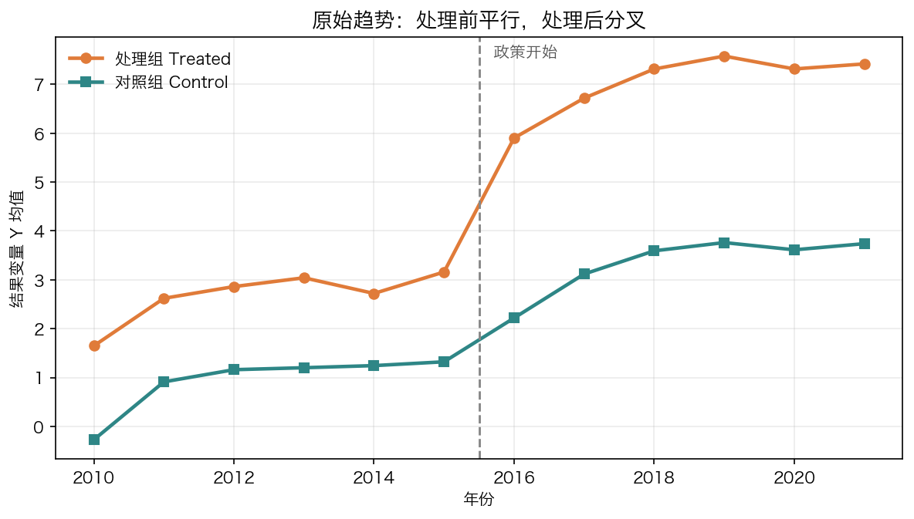
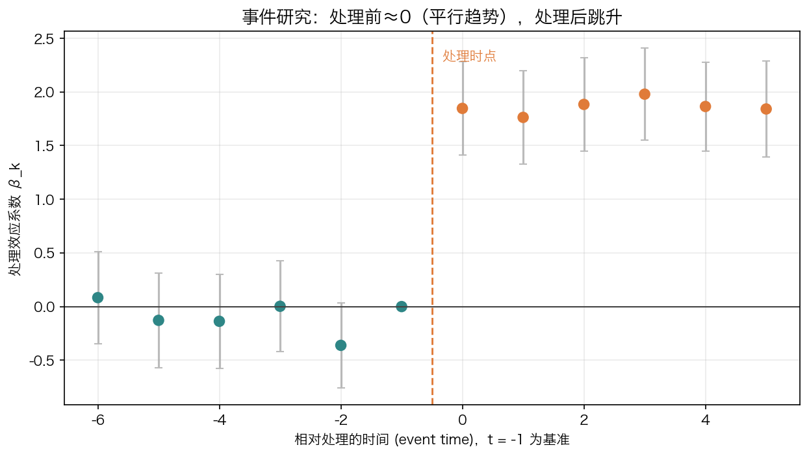

<div align="center">

# Paper-WorkFlow

### 经管 / 社科实证论文 · 从一句话 idea 到可复现投稿包的研究级 Workflow

A research-grade workflow for empirical papers: idea → design → evidence → manuscript → submission package.

<br/>

[English README](README.en.md)

<br/>

-4F46E5?style=flat-square)


<br/>

> 你给一个研究方向，它交付一套可审计的实证论文工程。
> 从选题、数据、识别设计、估计诊断、表图、写作、打磨、去 AI 味、模拟评审，到投稿包，
> 全部沉淀在一个可断点续跑的工作区里。

<br/>

<table>
  <tr>
    <td align="center">
      <a href="https://copaper.ai"></a>
    </td>
    <td width="56"></td>
    <td align="center">
      <a href="https://sccei.fsi.stanford.edu/reap"></a>
    </td>
  </tr>
</table>

<strong>Stanford REAP × CoPaper.AI</strong> · 面向实证研究的产学 AI 工具箱<br/>
<sub>从数据清洗到顶刊投稿的完整流水线，Paper-WorkFlow 是其中的论文总编排器</sub>

</div>

---

## 一图看懂

一篇实证论文不是一段文字，而是一套工程：研究设计、数据 provenance、识别假设、估计脚本、表图、稿件、审稿回应和 replication package 必须互相咬合。
Paper-WorkFlow 是这套工程的总编排器——它不亲自做每一步，而是在对的时点、用对的上下文、在对的人类决策点，把既有 skill、并行 subagent 和方法证据闸门串成一条完整 workflow。


<div align="center">

Stage 0（Intake & Setup）在最前面静默完成：建工作区、判入口、问档位、写状态文件。<br/>
双硬闸门：Stage 3 后过方法闸门，Stage 7 后过初稿质量门。一个拦方法硬伤，一个拦稿件硬伤；任一不过，都按「短板 → 回退阶段」自动回炉。

</div>

### 从 30 页讲义整合到当前版本

原来的 PDF 讲义把这套系统讲成 8 个教学阶段：选题、设计、数据、估计、呈现、写作、评审、投稿。当前版本把这条教学主线升级成可执行的 `Stage 0–9` 协议：增加 Stage 0 的工作区与状态初始化，把估计后的方法闸门和初稿后的质量闸门写成硬约束，并把复现包、数据治理和最终交付写入 `workflow_state.json`。

| 讲义阶段 | 当前执行位置 | 核心问题 | 关键技能 / 产物 |
|---|---|---|---|
| ① 选题 | Stage 1 | 问题是否有新意、重要、可识别 | `econfin-idea-finder`、`novelty-check`、`significance-search` → 选题卡片 |
| ② 设计 | Stage 1 | 因果问题、反事实、变异来源、目标期刊是否清楚 | `econfin-proposal`、`journal-digest` → `proposal.md` |
| ③ 数据 | Stage 2 | 数据源、键、频率、清洗口径是否可复跑 | `data-fetcher`、`data-cleaning` → `clean.parquet`、`codebook.md`、数据日志 |
| ④ 估计 | Stage 3 | 反事实从哪里来，最低诊断证据是否齐全 | **StatsPAI 引擎**（MCP 优先拍板/拟合/诊断）+ `did-analysis` / `iv-estimation` / `rdd-analysis` / `synthetic-control` 等 → `design_register.md`、`method_gate.md` |
| ⑤ 呈现 | Stage 4 | 审稿人能否一眼读懂结果和识别直觉 | **StatsPAI 出表栈**（Word/Excel/LaTeX 三格式同出）+ `table`、`figure` → 三线表、事件研究图、系数图 |
| ⑥ 写作 | Stage 5–7 | 初稿是否结构完整、论证克制、引用真实、没有 AI 味 | `paper-writer`、`paper-pipeline`、`readability` / `fix-chinese` → `main.tex`、质量评分卡 |
| ⑦ 评审 | Stage 8 | 在投稿前先暴露识别威胁、稳健性缺口和叙事问题 | `referee-report`、`paper-referee-revise` → 审稿意见、回应信、修订稿 |
| ⑧ 投稿 | Stage 9 | 期刊是否匹配，格式和材料是否一次准备齐 | `paper-submission`、`reference-verify` → journal shortlist、cover letter、投稿包 |

贯穿全程的横向能力包括 `web-research` / `arxiv` 查文献，`stata` / `stats` 做计量底座，`reference-verify` 核验引用，`markitdown` / `md-to-docx` 做文档互转。它们不是独立阶段，而是每个阶段的验证和转换工具。

---

## 为什么是「总编排器」，而不是又一个写作工具

| 普通 AI 写作工具 | Paper-WorkFlow |
|---|---|
| 帮你润色 / 续写某一段 | 帮你把整条流水线从选题跑到投稿 |
| 你得自己记得下一步该干嘛 | 用 `workflow_state.json` 记住进度，可断点续跑 |
| 一个大模型硬扛全部脏活 | 多代理 + 上下文保护：子代理写盘、只回传摘要，主代理上下文极省 |
| 容易在长任务里编造结果 | 真实优先：引用核验、数据取数、计量稳健性都交给可验证的工具 |
| 一路狂奔到底 | 失败会回退：平行趋势不过 / 弱工具 / 撞车，自动切备选并标红告知 |

核心纪律一句话：能调用就不要重写。流水线里每一步都调用既有成熟 skill，编排器只负责在对的时点把对的 skill 喂对的输入。

---

## 完整 Workflow 的三层架构

Paper-WorkFlow 不是单点写作助手，而是一个面向实证论文的研究操作系统：

| 层 | 负责什么 | 关键产物 |
|---|---|---|
| Orchestration Layer | Stage 0–9 的入口路由、断点续跑、subagent 派发、阶段闸门 | `workflow_state.json`、`logs/stage_<N>.md` |
| Evidence Layer | 数据、识别设计、估计、稳健性、方法证据包 | `design_register.md`、`method_gate.md`、`main_results.json`、`robustness/` |
| Manuscript Layer | 表图、初稿、打磨、去 AI 味、模拟评审、投稿材料 | `main.tex`、`quality_scorecard.md`、`response_letter.md`、`journal_shortlist.md` |

[`research-grade-methods.md`](references/research-grade-methods.md) 把现代应用计量与因果推断的 reviewer 标准前置到 Stage 3：交错 DiD、RDD、Synthetic DiD、DML、EconML/DoubleML、GRF、DoWhy refuter、PyFixest、AEA replication policy 都按「何时用、要交付什么证据、失败怎么回退」接入 workflow。

Stage 3–4 的统一估计与出版级出表引擎是 **StatsPAI**（[`statspai-analysis.md`](references/statspai-analysis.md)）：默认走已连接的 StatsPAI MCP 做 agent-native 拍板 / 拟合 / 诊断 / 稳健性自检 / 取引用（`detect_design → preflight → recommend → fit(as_handle) → audit_result → sensitivity_from_result → bibtex`），全程不落 Python；要出版级三格式表图（Word/Excel/LaTeX 同出）与 8 段 paper bundle 时切到 `statspai` 包（`sp.regtable` / `sp.paper_tables` / `sp.collect`）。它还把领域支线从应用计量扩到流行病学（target trial / IPTW / g-formula / TMLE / E-value）与 ML 因果（DML / meta-learner / causal forest / CATE / policy），并用七块稳健性闸门（安慰剂 · 替换样本 · 设定曲线 · 替换 SE · Oster 界 · HonestDiD · E-value）逐块喂满方法闸门的最低证据包。

### 47 个技能如何被编排

PDF 讲义里的技能地图已经合并到当前 README：`Paper-WorkFlow` 自己只做编排，真正的研究动作来自母仓库 `67-econfin-workflow-toolkit/` 等技能集合。

| 能力组 | 代表技能 | 在流水线里的位置 |
|---|---|---|
| 选题与设计 | `econfin-idea-finder`、`novelty-check`、`significance-search`、`journal-digest`、`econfin-proposal` | Stage 1，把兴趣变成可执行 proposal |
| 数据 | `data-fetcher`、`data-cleaning` | Stage 2，把分散数据变成可审计主表 |
| 计量估计 | **StatsPAI**（MCP + 包）、`ols-regression`、`panel-data`、`iv-estimation`、`did-analysis`、`rdd-analysis`、`synthetic-control`、`time-series`、`ml-causal`、`stata`、`stats` | Stage 3，按识别策略生成证据包 |
| 表与图 | **StatsPAI 出表栈**（`regtable`/`paper_tables`/`collect`，三格式同出）、`table`、`figure` | Stage 4，生成出版级 exhibits |
| 写作与润色 | `paper-writer`、`paper-style`、`paper-polish`、`paper-self-revise`、`paper-pipeline`、`readability` | Stage 5–7，从初稿到目标期刊风格 |
| 评审与引用 | `referee-report`、`paper-referee-revise`、`reference-verify` | Stage 8 和终审，做模拟审稿、修订与引用核验 |
| 投稿 | `paper-submission` | Stage 9，生成期刊清单、cover letter 与投稿材料 |
| 横向工具 | `web-research`、`arxiv`、`agent-browser`、`markitdown`、`md-to-docx`、`fix-chinese`、`marp-slides-creator`、`chinese-ppt` | 按需穿插，用于检索、转换、中文修订和展示材料 |

---

## 四道研究级标准

「跑完十个阶段」不等于「过得了顶刊 reviewer」。Paper-WorkFlow 用四道显式的研究级标准贯穿证据 → 写作 → 复现 → 投稿，让每一步都有可验收的门槛，而不是靠主代理自我感觉良好：

| 研究级标准 | 管什么（reviewer 会盯的） | 在哪生效 | 标准文件 |
|---|---|---|---|
| 方法证据标准 | 识别设计注册、按方法的最低证据包、稳健性矩阵、复现脚本 | Stage 3 · 方法闸门 | [`research-grade-methods.md`](references/research-grade-methods.md) |
| 学者写作标准 | 引言五段公式、贡献锋利度、经济量级解读、目标期刊房风 | Stage 1/5/6 · 质量门 ①④⑤ | [`writing-craft.md`](references/writing-craft.md) |
| 复现打包标准 | data provenance、复现包 README、数据可得性声明、一键重跑 | Stage 2→收尾 · 质量门 ⑦ | [`reproducibility-pack.md`](references/reproducibility-pack.md) |
| 评审与投稿标准 | 模拟评审深度、逐条 response letter、选刊决策序、cover letter | Stage 8/9 | [`peer-review-and-submission.md`](references/peer-review-and-submission.md) |

证据为真、表达到位、可被复跑、投得专业，才是这条流水线对「研究级」的完整定义。两道硬闸门正是前三道标准的强制落地：方法闸门验识别与稳健，初稿质量门验写作与复现；投稿标准守住最后一公里。

外加三道深化层和一条可照抄的范例，把四道标准压到「reviewer 真正会问的那几刀」上：

| 深化层 | 把哪一刀前置成作者自检 | 配合标准 |
|---|---|---|
| [识别威胁与审稿异议](references/threats-to-validity.md) | 坏控制 · 预趋势功效 · 弱工具 · 溢出…逐条「威胁 → 诊断 → 预防 → 回应」 | 方法证据 |
| [设计透明度与预分析](references/design-transparency.md) | 预分析计划 · 空结果报 MDE · 预趋势功效 + HonestDiD · 设定曲线 · 研究者自由度 | 方法 + 复现 |
| [文献检索与贡献定位](references/literature-and-positioning.md) | 滚雪球 + 引用图找全文献 · 文献矩阵看 whitespace · 定位句式钉贡献 | 写作 |

还附一条 [端到端「黄金路径」示例](references/worked-example.md)：用「绿色信贷 → 企业创新」逐阶段演示每步产物、两道闸门如何触发、`NOT PASS → 回退 → PASS` 的完整循环。既给人看「跑完得到什么」，也给编排器当填空范本。

再加两条工程护栏和一组模板，把 workflow 从“会跑”压到“可移交、可审计”：

| 护栏 | 防什么 | 文件 |
|---|---|---|
| [数据治理与公开包边界](references/data-governance.md) | restricted/confidential/PII、IRB/DUA、许可证、DAS 与 archive boundary 漏写 | `00_meta/data_governance.md`、`09_submission/DAS.md` |
| [运行时退化路径](references/runtime-fallbacks.md) | Skill/Agent/网络/MCP/Stata/R/Python/Zotero 缺失时假装验证成功 | `logs/stage_<N>.md`、`workflow_state.json.decisions` |
| [可复用 artifact 模板](templates/) | 每次临场自创 design register、method gate、scorecard、REPLICATION、FINAL_REPORT | `templates/*.md`、`templates/run_all.sh` |

---

## 你带什么进来，就从哪一站上车

不用每次都从头跑。Paper-WorkFlow 会根据你手头已有的东西自动选择入口：

| 你带来的 | 从哪进入 |
|---|---|
| 只有一句话想法 / 一个研究方向 | Stage 1 · 完整走选题漏斗 |
| 一份成形的 proposal（X→M→Y、识别策略、样本） | Stage 2 · 直接取数 |
| 已清洗好的数据 + 设计 | Stage 3 · 直接估计 |
| 已有回归结果 / 表图 | Stage 5 · 直接写初稿 |
| 一份 `main.tex` 初稿 | Stage 6 · 直接进打磨流水线 |
| 初稿 + 审稿意见 | Stage 8 · 直接按意见修订 |
| 一份成稿要投稿 | Stage 9 · 直接选刊 |

---

## 怎么用

在 [Claude Code](https://claude.com/claude-code) 里直接说触发语，并把手头已有的东西告诉它：

```text
/paper-workflow 我想做「绿色信贷政策对企业创新的影响」，目标期刊《经济研究》
/paper-workflow 这是我的计划书 ./proposal.md，帮我一条龙做到投稿
/paper-workflow 数据在 ./panel.csv，设计是 DiD，先把基准和稳健性跑出来
/paper-workflow 初稿在 ./paper/main.tex，从打磨开始
```

开跑前只问一次，三件套搞定（之后不再来回打断）：

| 选项 | 含义 |
|---|---|
| `全自动` | 无人值守，只在最终交付时汇报 |
| `阶段确认`（推荐） | 每阶段末给摘要卡，等你放行再进下一阶段 |
| `全程交互` | 每个子 skill 跑自己原生的逐项审批，投稿前终版用 |

外加目标期刊与语言（中 / 英 / 双语）——一次问清，全程不卡。

---

## 跑完你会得到什么

运行后所有产物沉淀在 `paper_workspace/<研究短名>_<时间戳>/`，可打包、可复现、可断点续跑：

```text
paper_workspace/<short>_<YYYYMMDD-HHMM>/
├── 00_meta/workflow_state.json      唯一权威进度文件（断点续跑依据）
│   ├── quality_scorecard.md         初稿质量门 7 维评分卡（放行/回炉判定）
│   └── data_governance.md           数据分级、PII、IRB/DUA、公开包边界
├── 01_proposal/proposal.md          定稿计划书：后续所有阶段的「合同」
├── 02_data/clean.parquet + codebook.md
├── 03_analysis/design_register.md   识别设计注册：estimand、假设、估计量、回退
│   ├── method_gate.md               方法闸门：最低证据包是否齐全
│   └── results/ + robustness/
├── 04_results/*.tex + *.pdf         出版级三线表与图
├── 05_draft/main.tex + ref.bib      结构完整的初稿
├── 06_polish/  07_dehumanize/  08_review/  09_submission/
│   └── submission_checklist.md + DAS.md
├── REPLICATION.md + run_all.sh      复现包 README + 一键重跑入口
├── logs/  backups/                  审计轨迹 + 每阶段快照（回滚路径）
└── FINAL_REPORT.md                  复盘表 + 交付清单 + 一键重跑命令
```

含计划书、清洗后数据 + codebook、识别设计注册、方法闸门报告、分析代码、出版级表图、`main.tex` + `ref.bib`、response letter、期刊清单 + cover letter、复现包 README / DAS，以及一份 `FINAL_REPORT.md` 全程复盘。

---

## 配套演示物料

仓库内保留一套开箱即用的教学 / 汇报物料：README 负责讲清楚整条工作流，Notebook 负责把其中「计量估计」这一步真正跑给观众看。原 30 页 PDF 讲义的 durable 内容已经整合进本 README，不再作为单独文件维护。

| 物料 | 内容 | 打开 |
|---|---|---|
| 工作流速读 | 8 个教学阶段 → `Stage 0–9` 执行协议、47 个技能地图、两道硬闸门、复现包要求 | 本 README |
| DiD 演示 | 6 个教学步骤 / 22 cells，一键跑通双重差分基准 + 事件研究 + 稳健性 | [`did_demo.ipynb`](did_demo.ipynb) |

Notebook 生成的图、表与结果资产均可重跑；演示用 PPTX / PDF 属于本地展示产物，不再入库。

### DiD 教学焦点

PDF 里的 DiD 部分已压缩成这组自检点，并和 `did_demo.ipynb` 对齐：

| 主题 | README / Notebook 里保留的要点 |
|---|---|
| 方法选型 | 先问处理如何分配：政策冲击走 DiD / 事件研究，阈值规则走 RDD，外生工具走 IV，单一处理单元走 SCM，观测性设计才走 Panel FE / OLS / ML。 |
| 2×2 DiD | `Treat × Post` 的系数是 ATT；面板设计优先用双向固定效应和按处理层级聚类的稳健标准误。 |
| 平行趋势 | 事件研究把单个 `Post` 拆成相对时间动态系数；处理前系数应接近 0，并配合 pre-trend joint test。 |
| 交错 DiD | 处理时点交错且效应异质时不能无脑 TWFE；先做 Goodman-Bacon 分解，再考虑 Callaway-Sant'Anna、Sun-Abraham、BJS / imputation、`did_multiplegt` 等现代估计量。 |
| 稳健性 | 平行趋势、伪处理时点、伪处理组、替换对照组、交错偏误、聚类 / wild bootstrap、anticipation、spillover、dose response。 |
| 表图标准 | 回归表要有系数、聚类标准误、固定效应、样本量、显著性脚注；事件研究图要有 95% CI、相对时间、清楚的 0 线和题注。 |

### DiD 演示一眼看懂

<table>
<tr>
<td width="50%"></td>
<td width="50%"></td>
</tr>
<tr>
<td align="center"><sub><b>① 原始趋势</b> · 处理组与对照组处理前平行、处理后分叉</sub></td>
<td align="center"><sub><b>② 事件研究</b> · 处理前系数 ≈ 0（平行趋势成立），处理后显著跳升</sub></td>
</tr>
</table>

基准回归（[`assets/did_table.tex`](assets/did_table.tex)）：处理效应稳健显著，加上双向固定效应后系数不变。

| | (1) OLS | (2) TWFE |
|---|---|---|
| Treat × Post | `1.953***` | `1.953***` |
| | (0.083) | (0.087) |
| 个体固定效应 | No | Yes |
| 年份固定效应 | No | Yes |
| $N$ | 2,400 | 2,400 |

---

## 九条设计纪律

1. 能调用就不要重写——编排器只在对的时点把对的 skill 喂对的输入，绝不复制其逻辑。
2. 上下文保护优先——任何要灌大段文本回主代理的操作，一律改成「子代理写盘 + 回传摘要」。
3. 真实优先，绝不编造——引用核验、数据来源、计量结论都以可验证的真实运行结果为准。
4. 方法标签必须有证据包——DiD / IV / RDD / SDID / DML / causal forest 等必须通过
   `design_register.md` + `method_gate.md`，缺最低诊断证据就不能写成主因果发现。
5. 失败要回退而非硬写成功——平行趋势不过 / 弱工具 / 不显著时自动切备选，并在闸门标红。
6. 人类决策点守在阶段闸门——定标题、定期刊、识别策略拍板、投稿前终审，必须经人放行。
7. 调用要稳，不靠运气——子 skill 是仓库文件夹、不保证已注册；调用优先 `Skill(<注册名>)`，
   报 not found 就退回 `Read <folder>/SKILL.md` 内联执行，并把硬编码 Windows 输出路径的 skill 重定向
   进工作区。不让 subagent 凭记忆脑补子 skill。（细则见 [skill 路由表 §0](references/skill-map.md)。）
8. 「高质量」是可验收的闸门，不是口号——Stage 7 后强制过初稿质量门：独立 critic 按 7 维 rubric
   打分，达标（每维 ≥7、总分 ≥56/70、识别·稳健·引用无致命红旗）才放行，不达标按映射自动回炉。
   让「高质量初稿」有阈值、可回退、可审计。（评分卡见 [quality-rubric.md](references/quality-rubric.md)。）
9. 复现包从第一天开始——Stage 2 起记录 data provenance、访问限制、随机种子与重跑成本；收尾必须有
   `REPLICATION.md`、DAS（如需）和 master script，状态写进 `replication_pack`。

---

## 仓库结构

```text
Paper-WorkFlow/
├── SKILL.md                          # 总编排器（入口 · 完整执行协议）
├── README.md                         # 中文说明（已整合原 PDF 讲义要点）
├── README.en.md                      # English README（与中文版同步的最新版）
├── validate_skill.py                 # 本目录自检：模板、链接、workspace init、Notebook 结构
├── scripts/
│   └── smoke_workspace.py            # 临时最小工作区 + 模板实例化 smoke test
├── templates/                        # 关键 artifact 模板
│   ├── design_register.md
│   ├── method_gate.md
│   ├── quality_scorecard.md
│   ├── data_governance.md
│   ├── DAS.md
│   ├── REPLICATION.md
│   ├── submission_checklist.md
│   ├── FINAL_REPORT.md
│   └── run_all.sh
├── references/
│   ├── stage-playbook.md             # 10 阶段逐阶段操作手册
│   ├── skill-map.md                  # 「任务 → 用哪个 skill」全量路由表
│   ├── worked-example.md             # 端到端「黄金路径」示例（含两道闸门触发 + 回退）
│   ├── research-grade-methods.md     # 现代因果推断 / 应用计量方法增强包 + 方法闸门
│   ├── statspai-analysis.md          # Stage 3–4 StatsPAI 引擎：MCP + 包、三模式、估计量路由、三格式出表、七块稳健性闸门
│   ├── threats-to-validity.md        # 识别威胁 × 审稿异议预案（坏控制 · 预趋势 · 弱工具）
│   ├── design-transparency.md        # 设计透明度：预分析 · 功效/MDE · 设定曲线 · 研究者自由度
│   ├── writing-craft.md              # 学者写作标准：引言公式 · 贡献锋利度 · 量级 · 房风
│   ├── literature-and-positioning.md # 文献检索与贡献定位：滚雪球 · 文献矩阵 · 定位句式
│   ├── reproducibility-pack.md       # 复现打包标准：provenance · 复现包 README · DAS
│   ├── peer-review-and-submission.md # 评审与投稿标准：模拟评审 · response · 选刊 · cover letter
│   ├── quality-rubric.md             # 初稿质量门 7 维评分卡（达标阈值 + 短板→回退映射）
│   ├── data-governance.md            # 敏感/受限数据、IRB/DUA、DAS、公开包边界
│   ├── runtime-fallbacks.md          # 工具/网络/MCP/统计软件缺失时的退化路径
│   ├── subagent-templates.md         # subagent 派发模板（含上下文保护契约）
│   └── workspace-and-state.md        # 工作区布局 + 状态字段 + 子代理 I/O 约定
├── assets/
│   ├── init_workspace.sh             # 一键铺出工作区骨架（拒绝覆盖已存在路径）
│   ├── workflow_state.template.json  # 进度状态文件模板（v4：含 method_gate + quality_gate + replication_pack）
│   ├── workflow.svg                  # 全流程流水线示意图
│   ├── did_table.tex                 # 演示 · DiD 基准回归表（OLS / TWFE）
│   ├── fig_event_study.png · fig_raw_trends.png   # 演示 · 事件研究 / 原始趋势图
│   └── copaper-logo.png · stanford-reap-logo.png · copaper-qrcode.png · copaper-wechat.jpg  # CoPaper.AI × Stanford REAP 品牌物料
│
│   —— 以下为配套演示物料 ——
└── did_demo.ipynb                    # DiD 快速演示 Notebook
```

进一步阅读（按需加载）：[`SKILL.md`](SKILL.md) ｜
[阶段操作手册](references/stage-playbook.md) ｜
[skill 路由表](references/skill-map.md) ｜
[研究级方法增强包](references/research-grade-methods.md) ｜
[StatsPAI 估计与出表引擎](references/statspai-analysis.md) ｜
[学者写作标准](references/writing-craft.md) ｜
[复现打包标准](references/reproducibility-pack.md) ｜
[评审与投稿标准](references/peer-review-and-submission.md) ｜
[质量门评分卡](references/quality-rubric.md) ｜
[subagent 模板](references/subagent-templates.md) ｜
[工作区与状态](references/workspace-and-state.md) ｜
[端到端示例](references/worked-example.md) ｜
[识别威胁与审稿异议](references/threats-to-validity.md) ｜
[设计透明度与预分析](references/design-transparency.md) ｜
[文献检索与定位](references/literature-and-positioning.md) ｜
[数据治理](references/data-governance.md) ｜
[运行时退化](references/runtime-fallbacks.md) ｜
[artifact 模板](templates/)

### 本地自检

维护或改造本 skill 后，先在本目录运行：

```bash
python3 validate_skill.py
python3 scripts/smoke_workspace.py
```

它会检查本地 Markdown 链接、`workflow_state` schema、`init_workspace.sh` 的拒绝覆盖行为、核心资产、模板契约、最小工作区 smoke fixture 与 DiD Notebook 结构。母仓库发布前再从仓库根目录跑 `make check`。

---

## 关于母仓库

Paper-WorkFlow 是 [Auto-Empirical-Research-Skills](https://github.com/brycewang-stanford/Auto-Empirical-Research-Skills)（一套面向经管 / 社科实证研究的 skill 合集，含 69 个编号集合）中的总编排器。它本身不内置任何被编排的子 skill，运行时按需调用母仓库 `67-econfin-workflow-toolkit/` 等集合里的能力。

- 执行范式采用「多代理 + 上下文保护」：子代理自己写盘、只回传状态摘要，主代理只持有指针与状态。
- 编排范式来自 `67-econfin-workflow-toolkit/paper-pipeline`（固定顺序 + 断点续跑 + 交互档位）。
- 混合来源集合的再分发请各自核对其上游许可。

---

## 许可

本仓库（编排器 skill + 配套演示物料）以 [MIT License](LICENSE) 发布，可自由使用、修改、再分发。
被编排的子 skill 不在本仓库内，运行时按需调用母仓库
[`Auto-Empirical-Research-Skills`](https://github.com/brycewang-stanford/Auto-Empirical-Research-Skills)；
那些混合来源集合的再分发，请各自核对其上游许可。

<div align="center">

<br/>

从一句话想法到可投稿全文，让流水线替你跑完中间那一百步。

如果它帮到你，欢迎点个 Star。

<br/>

<table>
  <tr>
    <td align="center">
      <a href="https://copaper.ai"></a>
    </td>
    <td width="40"></td>
    <td align="center">
      <a href="https://sccei.fsi.stanford.edu/reap"></a>
    </td>
  </tr>
</table>

<sub><strong>Stanford REAP × CoPaper.AI</strong> · 面向实证研究的产学 AI 工具箱</sub>

<br/>

<table>
  <tr>
    <td align="center">
      <a href="https://copaper.ai"></a><br/>
      <strong>访问 <a href="https://copaper.ai">copaper.ai</a></strong>
    </td>
    <td width="40"></td>
    <td align="center">
      <br/>
      <strong>微信：CoPaper.AI</strong>
    </td>
  </tr>
</table>

由 <a href="https://copaper.ai"><strong>CoPaper.AI</strong></a> 维护，孵化于 <a href="https://sccei.fsi.stanford.edu/reap"><strong>Stanford REAP / SCCEI</strong></a> · 实证研究 AI 助手

</div>
