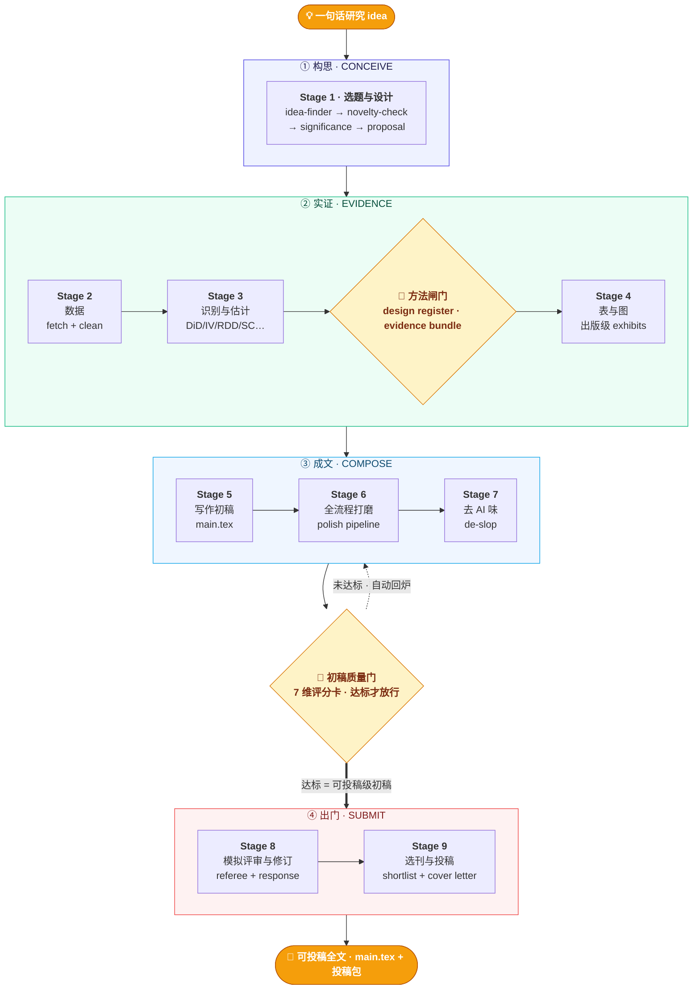

<div align="center">

# 📑 Paper-WorkFlow

### 经管 / 社科实证论文 · 从一句话 idea 到可复现投稿包的研究级 Workflow OS

**A research-grade workflow operating system for empirical papers: idea → design → evidence → manuscript → submission package.**

<br/>

-4F46E5?style=for-the-badge)


<br/>

> **你给一个研究方向，它交付一套可审计的实证论文工程。**
> 从「选题 · 数据 · 识别设计 · 估计诊断 · 表图 · 写作 · 打磨 · 去 AI 味 · 模拟评审 · 投稿包」
> 到「方法闸门 · 初稿质量门 · 复现说明」，全部沉淀在一个可断点续跑的工作区里。

</div>

---

## 💡 → 📄 一图看懂

一篇实证论文不是一段文字，而是一套工程：研究设计、数据 provenance、识别假设、估计脚本、表图、稿件、审稿回应和 replication package 必须互相咬合。
**Paper-WorkFlow 是这套工程的总编排器**：它不亲自做每一步，而是在**对的时点、用对的上下文、在对的人类决策点**，把既有 skill / 并行 subagent / 方法证据闸门串成一条完整 workflow。



<div align="center">

**Stage 0（Intake & Setup）在最前面静默完成**：建工作区 · 判入口 · 问档位 · 写状态文件。<br/>
**双硬闸门**：Stage 3 后过 🔬 **方法闸门**，Stage 7 后过 🏁 **初稿质量门**。一个拦方法硬伤，一个拦稿件硬伤；任一不过，都按「短板 → 回退阶段」自动回炉。

</div>

---

## 🎯 为什么是「总编排器」，而不是又一个写作工具

| 普通 AI 写作工具 | **Paper-WorkFlow** |
|---|---|
| 帮你润色 / 续写**某一段** | 帮你把**整条流水线**从选题跑到投稿 |
| 你得自己记得下一步该干嘛 | 它用 `workflow_state.json` **记住进度**，可断点续跑 |
| 一个大模型硬扛全部脏活 | **多代理 + 上下文保护**：子代理写盘、只回传摘要，主代理上下文极省 |
| 容易在长任务里「编造」结果 | **真实优先**：引用核验、数据取数、计量稳健性都交给可验证的工具 |
| 一路狂奔到底 | **失败会回退**：平行趋势不过 / 弱工具 / 撞车，自动切备选并标红告知 |

> 核心纪律一句话：**能调用就不要重写。** 流水线里每一步都调用既有成熟 skill，编排器只负责
> 「在对的时点把对的 skill 喂对的输入」。

---

## 🧭 完整 Workflow 的三层架构

Paper-WorkFlow 不是单点写作助手，而是一个面向实证论文的研究操作系统：

| 层 | 负责什么 | 关键产物 |
|---|---|---|
| **Orchestration Layer** | Stage 0–9 的入口路由、断点续跑、subagent 派发、阶段闸门 | `workflow_state.json`、`logs/stage_<N>.md` |
| **Evidence Layer** | 数据、识别设计、估计、稳健性、方法证据包 | `design_register.md`、`method_gate.md`、`main_results.json`、`robustness/` |
| **Manuscript Layer** | 表图、初稿、打磨、去 AI 味、模拟评审、投稿材料 | `main.tex`、`quality_scorecard.md`、`response_letter.md`、`journal_shortlist.md` |

新增的 [`research-grade-methods.md`](references/research-grade-methods.md) 把现代应用计量与因果推断的 reviewer 标准前置到 Stage 3：
交错 DiD、RDD、Synthetic DiD、DML、EconML/DoubleML、GRF、DoWhy refuter、PyFixest、AEA replication policy 都按「何时用、要交付什么证据、失败怎么回退」接入 workflow。

---

## 📐 四道研究级标准 —— 把「完整 workflow」钉成可验收的工程

「跑完十个阶段」不等于「过得了顶刊 reviewer」。Paper-WorkFlow 用**四道显式的研究级标准**贯穿
证据 → 写作 → 复现 → 投稿，让每一步都有可验收的门槛，而不是靠主代理自我感觉良好：

| 研究级标准 | 管什么（reviewer 会盯的） | 在哪生效 | 标准文件 |
|---|---|---|---|
| 🔬 **方法证据标准** | 识别设计注册、按方法的最低证据包、稳健性矩阵、复现脚本 | Stage 3 · **方法闸门** | [`research-grade-methods.md`](references/research-grade-methods.md) |
| ✍️ **学者写作标准** | 引言五段公式、贡献锋利度、经济量级解读、目标期刊房风 | Stage 1/5/6 · **质量门 ①④⑤** | [`writing-craft.md`](references/writing-craft.md) |
| ♻️ **复现打包标准** | data provenance、复现包 README、数据可得性声明、一键重跑 | Stage 2→收尾 · **质量门 ⑦** | [`reproducibility-pack.md`](references/reproducibility-pack.md) |
| 📮 **评审与投稿标准** | 模拟评审深度、逐条 response letter、选刊决策序、cover letter | Stage 8/9 | [`peer-review-and-submission.md`](references/peer-review-and-submission.md) |

> **证据为真（方法证据标准）+ 表达到位（写作标准）+ 可被复跑（复现标准）+ 投得专业（投稿标准）**，
> 才是这条流水线对「研究级」的完整定义。两道硬闸门正是前三道标准的强制落地——
> **方法闸门**验识别与稳健，**初稿质量门**验写作与复现；投稿标准守住最后一公里。

**外加三道深化层 + 一条可照抄的范例**，把四道标准压到「reviewer 真正会问的那几刀」上：

| 深化层 | 把哪一刀前置成作者自检 | 配合标准 |
|---|---|---|
| 🛡️ [识别威胁与审稿异议](references/threats-to-validity.md) | 坏控制 · 预趋势功效 · 弱工具 · 溢出…逐条「威胁 → 诊断 → 预防 → 回应」 | 方法证据 |
| 🔭 [设计透明度与预分析](references/design-transparency.md) | 预分析计划 · 空结果报 MDE · 预趋势功效 + HonestDiD · 设定曲线 · 研究者自由度 | 方法 + 复现 |
| 📚 [文献检索与贡献定位](references/literature-and-positioning.md) | 滚雪球 + 引用图找全文献 · 文献矩阵看白space · 定位句式钉贡献 | 写作 |

> 还附一条 [端到端「黄金路径」示例](references/worked-example.md)：用「绿色信贷 → 企业创新」逐阶段演示每步
> 产物、两道闸门如何触发、`NOT PASS → 回退 → PASS` 的完整循环——既给人看「跑完得到什么」，也给编排器
> 当填空范本。

---

## 🚉 你带什么进来，就从哪一站上车

不用每次都从头跑。Paper-WorkFlow 会根据你手头**已有的东西**自动选择入口：

| 你带来的 | 从哪进入 |
|---|---|
| 只有一句话想法 / 一个研究方向 | **Stage 1** · 完整走选题漏斗 |
| 一份成形的 proposal（X→M→Y、识别策略、样本） | **Stage 2** · 直接取数 |
| 已清洗好的数据 + 设计 | **Stage 3** · 直接估计 |
| 已有回归结果 / 表图 | **Stage 5** · 直接写初稿 |
| 一份 `main.tex` 初稿 | **Stage 6** · 直接进打磨流水线 |
| 初稿 + 审稿意见 | **Stage 8** · 直接按意见修订 |
| 一份成稿要投稿 | **Stage 9** · 直接选刊 |

---

## ⚡ 怎么用

在 [Claude Code](https://claude.com/claude-code) 里直接说触发语，并把手头已有的东西告诉它：

```text
/paper-workflow 我想做「绿色信贷政策对企业创新的影响」，目标期刊《经济研究》
/paper-workflow 这是我的计划书 ./proposal.md，帮我一条龙做到投稿
/paper-workflow 数据在 ./panel.csv，设计是 DiD，先把基准和稳健性跑出来
/paper-workflow 初稿在 ./paper/main.tex，从打磨开始
```

**开跑前只问一次**，三件套搞定（之后不再来回打断）：

| 选项 | 含义 |
|---|---|
| 🤖 `全自动` | 无人值守，只在最终交付时汇报 |
| ✅ `阶段确认`（**推荐**） | 每阶段末给摘要卡，等你放行再进下一阶段 |
| 🔍 `全程交互` | 每个子 skill 跑自己原生的逐项审批，投稿前终版用 |

外加 **目标期刊** 与 **语言（中 / 英 / 双语）** —— 一次问清，全程不卡。

---

## 📦 跑完你会得到什么（一个自包含工作区）

运行后所有产物沉淀在 `paper_workspace/<研究短名>_<时间戳>/`，可打包、可复现、可断点续跑：

```text
paper_workspace/<short>_<YYYYMMDD-HHMM>/
├── 00_meta/workflow_state.json     ★唯一权威进度文件（断点续跑依据）
│   └── quality_scorecard.md        ★初稿质量门 7 维评分卡（放行/回炉判定）
├── 01_proposal/proposal.md         ★定稿计划书：后续所有阶段的「合同」
├── 02_data/clean.parquet + codebook.md
├── 03_analysis/design_register.md  ★识别设计注册：estimand、假设、估计量、回退
│   ├── method_gate.md              ★方法闸门：最低证据包是否齐全
│   └── results/ + robustness/
├── 04_results/*.tex + *.pdf        出版级三线表与图
├── 05_draft/main.tex + ref.bib     ★结构完整的初稿
├── 06_polish/  07_dehumanize/  08_review/  09_submission/
├── REPLICATION.md + run_all.sh      ★复现包 README + 一键重跑入口
├── logs/  backups/                 审计轨迹 + 每阶段快照（回滚路径）
└── FINAL_REPORT.md                 ★复盘表 + 交付清单 + 一键重跑命令
```

📋 含计划书、清洗后数据 + codebook、识别设计注册、方法闸门报告、分析代码、出版级表图、
`main.tex` + `ref.bib`、response letter、期刊清单 + cover letter、复现包 README / DAS，以及一份
`FINAL_REPORT.md` 全程复盘。

---

## 🎬 配套演示物料（讲清楚 + 跑给你看）

仓库内附一套**开箱即用的教学 / 汇报物料**：用 30 页讲义把整条工作流讲清楚，再用一个 Notebook 把其中
「计量估计」这一步真正**跑给观众看**。

| 物料 | 内容 | 打开 |
|---|---|---|
| 📊 **流程讲义** | 30 页 PDF，从选题到投稿的端到端流水线（GitHub 可在线预览） | [PDF](社科实证论文工作流.pdf) |
| 🧪 **DiD 演示** | 22 cells，一键跑通双重差分基准 + 事件研究 + 稳健性 | [`did_demo.ipynb`](did_demo.ipynb) |

> 图、表、Notebook 与 30 页讲义（经 PPTX 导出为 PDF）均可一键复现（构建脚本与 PPTX 为本地产物，不入库）。

### DiD 演示一眼看懂

<table>
<tr>
<td width="50%"></td>
<td width="50%"></td>
</tr>
<tr>
<td align="center"><sub><b>① 原始趋势</b> · 处理组与对照组处理前平行、处理后分叉</sub></td>
<td align="center"><sub><b>② 事件研究</b> · 处理前系数 ≈ 0（平行趋势成立），处理后显著跳升</sub></td>
</tr>
</table>

基准回归（[`assets/did_table.tex`](assets/did_table.tex)）：处理效应稳健显著，加上双向固定效应后系数不变。

| | (1) OLS | (2) TWFE |
|---|---|---|
| Treat × Post | `1.953***` | `1.953***` |
| | (0.083) | (0.087) |
| 个体固定效应 | No | Yes |
| 年份固定效应 | No | Yes |
| $N$ | 2,400 | 2,400 |

---

## 🛡️ 九条设计纪律（为什么值得信任）

1. **能调用就不要重写** —— 编排器只在对的时点把对的 skill 喂对的输入，绝不复制其逻辑。
2. **上下文保护优先** —— 任何要灌大段文本回主代理的操作，一律改成「子代理写盘 + 回传摘要」。
3. **真实优先，绝不编造** —— 引用核验、数据来源、计量结论都以可验证的真实运行结果为准。
4. **方法标签必须有证据包** —— DiD / IV / RDD / SDID / DML / causal forest 等必须通过
   `design_register.md` + `method_gate.md`，缺最低诊断证据就不能写成主因果发现。
5. **失败要回退而非硬写成功** —— 平行趋势不过 / 弱工具 / 不显著时自动切备选，并在闸门标红。
6. **人类决策点守在阶段闸门** —— 定标题、定期刊、识别策略拍板、投稿前终审，必须经人放行。
7. **调用要稳，不靠运气** —— 子 skill 是仓库文件夹、不保证已注册；调用优先 `Skill(<注册名>)`，
   报 not found 就退回 `Read <folder>/SKILL.md` 内联执行，并把硬编码 Windows 输出路径的 skill 重定向
   进工作区。**绝不让 subagent 凭记忆脑补子 skill。**（细则见 [skill 路由表 §0](references/skill-map.md)。）
8. **「高质量」是可验收的闸门，不是口号** —— Stage 7 后强制过初稿质量门：独立 critic 按 7 维 rubric
   打分，达标（每维 ≥7、总分 ≥56/70、识别·稳健·引用无致命红旗）才放行，不达标按映射自动回炉。
   让「高质量初稿」有阈值、可回退、可审计。（评分卡见 [quality-rubric.md](references/quality-rubric.md)。）
9. **复现包从第一天开始** —— Stage 2 起记录 data provenance、访问限制、随机种子与重跑成本；收尾必须有
   `REPLICATION.md`、DAS（如需）和 master script，状态写进 `replication_pack`。

---

## 🗂️ 仓库结构

```text
Paper-WorkFlow/
├── SKILL.md                          # 总编排器（入口 · 完整执行协议）
├── README.md                         # 本文件（流程理念海报）
├── validate_skill.py                  # 本目录自检：模板、链接、workspace init、Notebook 结构
├── references/
│   ├── stage-playbook.md             # 10 阶段逐阶段操作手册
│   ├── skill-map.md                  # 「任务 → 用哪个 skill」全量路由表
│   ├── worked-example.md             # 端到端「黄金路径」示例（含两道闸门触发 + 回退）
│   ├── research-grade-methods.md     # 现代因果推断 / 应用计量方法增强包 + 方法闸门
│   ├── threats-to-validity.md        # 识别威胁 × 审稿异议预案（坏控制 · 预趋势 · 弱工具）
│   ├── design-transparency.md        # 设计透明度：预分析 · 功效/MDE · 设定曲线 · 研究者自由度
│   ├── writing-craft.md              # 学者写作标准：引言公式 · 贡献锋利度 · 量级 · 房风
│   ├── literature-and-positioning.md # 文献检索与贡献定位：滚雪球 · 文献矩阵 · 定位句式
│   ├── reproducibility-pack.md       # 复现打包标准：provenance · 复现包 README · DAS
│   ├── peer-review-and-submission.md # 评审与投稿标准：模拟评审 · response · 选刊 · cover letter
│   ├── quality-rubric.md             # 初稿质量门 7 维评分卡（达标阈值 + 短板→回退映射）
│   ├── subagent-templates.md         # subagent 派发模板（含上下文保护契约）
│   └── workspace-and-state.md        # 工作区布局 + 状态字段 + 子代理 I/O 约定
├── assets/
│   ├── init_workspace.sh             # 一键铺出工作区骨架（拒绝覆盖已存在路径）
│   ├── workflow_state.template.json  # 进度状态文件模板（v4：含 method_gate + quality_gate + replication_pack）
│   ├── workflow.svg                  # 全流程流水线示意图
│   ├── did_table.tex                 # 演示 · DiD 基准回归表（OLS / TWFE）
│   └── fig_event_study.png · fig_raw_trends.png   # 演示 · 事件研究 / 原始趋势图
│
│   —— 以下为配套演示物料 ——
├── 社科实证论文工作流.pdf            # 30 页流程讲义（PPTX 导出件；PPTX 本地生成、不入库）
└── did_demo.ipynb                    # DiD 快速演示 Notebook
```

> 进一步阅读（按需加载）：[`SKILL.md`](SKILL.md) ｜
> [阶段操作手册](references/stage-playbook.md) ｜
> [skill 路由表](references/skill-map.md) ｜
> [研究级方法增强包](references/research-grade-methods.md) ｜
> [学者写作标准](references/writing-craft.md) ｜
> [复现打包标准](references/reproducibility-pack.md) ｜
> [评审与投稿标准](references/peer-review-and-submission.md) ｜
> [质量门评分卡](references/quality-rubric.md) ｜
> [subagent 模板](references/subagent-templates.md) ｜
> [工作区与状态](references/workspace-and-state.md) ｜
> [端到端示例](references/worked-example.md) ｜
> [识别威胁与审稿异议](references/threats-to-validity.md) ｜
> [设计透明度与预分析](references/design-transparency.md) ｜
> [文献检索与定位](references/literature-and-positioning.md)

### 本地自检

维护或改造本 skill 后，先在本目录运行：

```bash
python3 validate_skill.py
```

它会检查本地 Markdown 链接、`workflow_state` schema、`init_workspace.sh` 的拒绝覆盖行为、核心资产与
DiD Notebook 结构。母仓库发布前再从仓库根目录跑 `make check`。

---

## 🔗 关于母仓库

Paper-WorkFlow 是 **[Auto-Empirical-Research-Skills](https://github.com/brycewang-stanford/Auto-Empirical-Research-Skills)**
（一套面向经管 / 社科实证研究的 skill 合集，含 69 个编号集合）中的**总编排器**。它本身不内置任何被
编排的子 skill —— 运行时按需调用母仓库 `67-econfin-workflow-toolkit/` 等集合里的能力。

- 执行范式模仿自 `do-agent`（多代理 + 上下文保护，母仓库授权模仿）。
- 编排范式来自 `67-econfin-workflow-toolkit/paper-pipeline`（固定顺序 + 断点续跑 + 交互档位）。
- 混合来源集合的再分发请各自核对其上游许可。

---

## 📄 许可

本仓库（编排器 skill + 配套演示物料）以 **[MIT License](LICENSE)** 发布，可自由使用、修改、再分发。
被编排的子 skill **不在本仓库内**，运行时按需调用母仓库
[`Auto-Empirical-Research-Skills`](https://github.com/brycewang-stanford/Auto-Empirical-Research-Skills)；
那些混合来源集合的再分发，请各自核对其上游许可。

<div align="center">

<br/>

**从 💡 到 📄，让流水线替你跑完中间的一百步。**

⭐ 觉得有用就点个 Star，让更多做实证的人看到。

</div>
