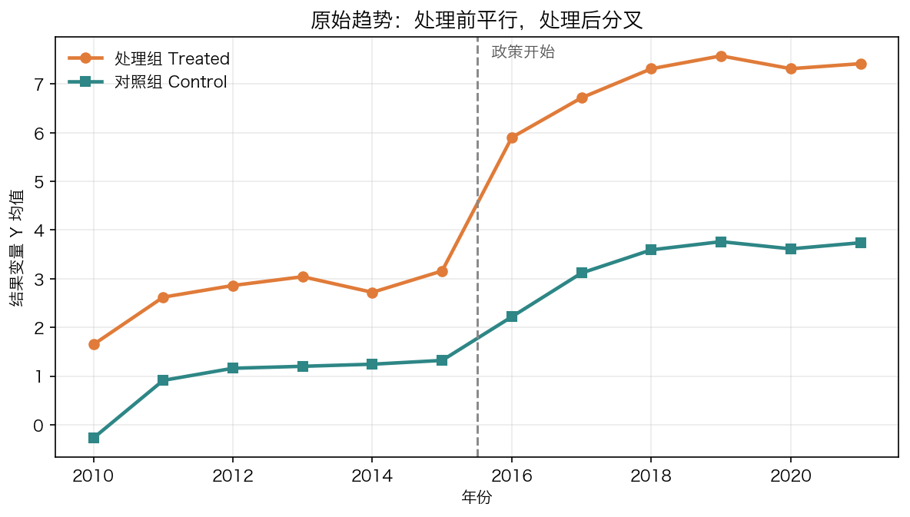
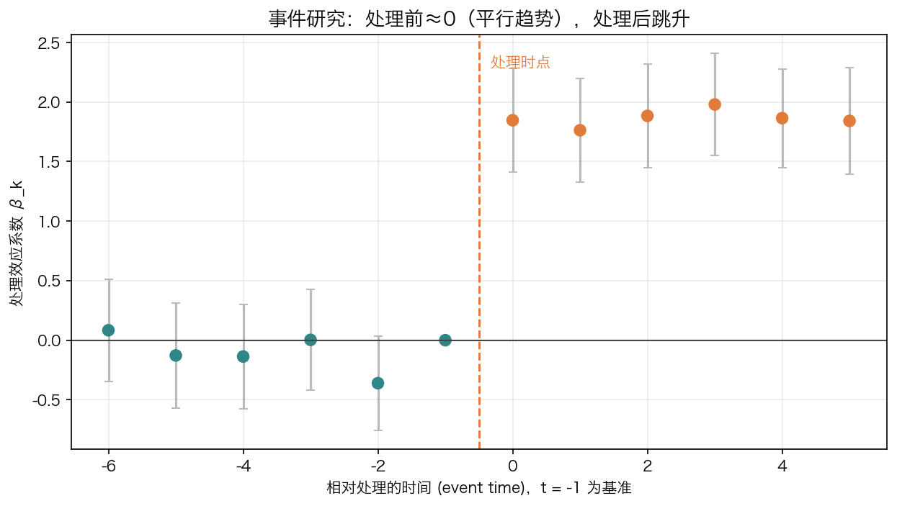

<div align="center">

# Paper-WorkFlow

### 经管 / 社科实证研究的端到端 AI 工作流

**从研究 idea、数据与识别设计，到可复现的表图、论文初稿和投稿材料。**

[](#工作流全景)
[](#它是什么)
[](#能力地图)
[](LICENSE)

</div>

Paper-WorkFlow 把一项实证研究拆成可审阅、可回退、可断点续跑的 10 个阶段，并为每个阶段路由合适的
研究 skill 或子代理。它不仅处理论文写作，还覆盖写作之前最关键的工作：选题查新、数据获取与清理、
因果识别、真实估计、稳健性检验以及表图制作。

实际产物取决于输入材料、数据与工具权限，以及各阶段检查结果；“端到端”指工作流覆盖范围，不代表每个
研究都会得到显著结论、通过质量门或形成可投稿论文。

> **准确定位：**本仓库是一个 **meta-orchestrator（总编排器）**，包含编排协议、状态模板、质量门和
> 演示材料；它不是一个内置数据、计量软件和全部研究能力的独立 CLI。完整运行依赖母仓库中的相关
> skills，以及研究任务所需的数据访问、联网检索、Python / R / Stata 等工具。详见[运行前提与边界](#运行前提与边界)。

## 它是什么

一篇实证论文通常不是“生成一篇文章”，而是一条有依赖关系的研究链：idea 决定数据需求，数据质量约束
识别设计，估计结果决定稳健性与叙事，表图和引用又必须与真实结果一致。Paper-WorkFlow 的工作是管理这条链：

- **按已有材料选择入口**：可以从一句 idea 开始，也可以从 proposal、干净数据、回归结果或现有初稿接入。
- **调用专门能力完成各阶段**：取数、清洗、DiD / IV / RDD / 合成控制、表图、写作、引用核验等由对应 skill 执行。
- **把产物写入统一工作区**：研究设计、代码、数据字典、结果、表图、稿件与日志都有约定路径。
- **用状态文件断点续跑**：`workflow_state.json` 记录阶段状态、关键产物和研究决策。
- **在失败时回退**：平行趋势、弱工具、引用真实性等关键检查不过时，回到设计、数据或估计阶段，而不是把失败写成成功。
- **用质量门验收初稿**：Stage 7 后按 7 个维度独立评分；满足阈值后才进入模拟评审与投稿准备。

## 工作流全景


```mermaid
flowchart LR
    I["研究 idea / 已有材料"] --> S0["0 接入与设置"]
    S0 --> S1["1 选题与研究设计"]
    S1 --> S2["2 数据获取与清理"]
    S2 --> S3["3 识别、估计与稳健性"]
    S3 --> S4["4 表格与可视化"]
    S4 --> S5["5 论文初稿"]
    S5 --> S6["6 结构与表达打磨"]
    S6 --> S7["7 语言修订"]
    S7 --> Q{"初稿质量门"}
    Q -->|"未达标"| R["回到 Stage 1–6 的对应短板阶段"]
    R --> Q
    Q -->|"达标"| S8["8 模拟评审与修订"]
    S8 --> S9["9 选刊与投稿材料"]
    S9 --> O["论文工作区 + 最终报告"]
```

质量门是 Stage 7 与 Stage 8 之间的验收闸门，不是第 11 个阶段。它由与写作任务分离的 critic 子代理
依据落盘证据评分，减少同一执行上下文直接自评的偏差，但不等同于外部同行评审。它检查贡献、识别、
稳健性、解读、结构、引用和可复现性；项目当前规则要求
**每维至少 7/10、总分至少 56/70，且识别、稳健性、引用没有致命红旗**。评分细则见
[`references/quality-rubric.md`](references/quality-rubric.md)。这些阈值是本项目的工作流验收标准，
不是经过外部验证的期刊录用预测器；同一维度回退两轮仍未达标时，工作流会显著报告已知短板，由研究者
决定停止、继续修改或带风险进入后续阶段。

## 能力地图

| 阶段 | 解决的问题 | 典型动作 | 主要产物 |
|---|---|---|---|
| 0 · 接入 | 从哪里开始，如何运行 | 判断入口、选择交互档位、建立工作区 | `intake.md`、`workflow_state.json` |
| 1 · Idea 与设计 | 题目是否新、重要且可识别 | 候选 idea、查新、重要性、期刊口味、proposal | `proposal.md` |
| 2 · 数据 | 变量从哪里来，如何形成分析样本 | 取数、清洗、合并、缺失与极端值处理、数据审计 | 干净数据、清洗脚本、`codebook.md` |
| 3 · 实证 | 识别假设是否可信，结果是否稳健 | DiD / IV / RDD / SC / 面板 / 时序 / ML 因果；机制、异质性、安慰剂 | 估计代码、原始结果、稳健性结果、审计报告 |
| 4 · 表图 | 结果能否被准确阅读和核验 | 三线表、描述统计、事件研究图、系数图 | `.tex` 表格、`.pdf/.png` 图、exhibit 索引 |
| 5 · 初稿 | 如何由真实证据形成完整论证 | 引言、背景、数据、设计、结果、稳健性、结论 | `main.tex`、`ref.bib` |
| 6 · 论文打磨 | 结构与期刊风格是否成熟 | 自评修订、风格适配、引用核验 | 打磨稿、引用核验报告 |
| 7 · 语言修订 | 中英文表达是否准确、自然 | 可读性、中文混排与去模板化表达检查 | 语言修订稿 |
| 质量门 | 初稿是否达到预设标准 | 独立 critic 评分、定位短板、同一维度最多回退两轮 | `quality_scorecard.md` |
| 8 · 模拟评审 | 投稿前还有哪些学术硬伤 | referee report、逐条回应、修订复核 | 修订稿、response letter |
| 9 · 投稿准备 | 投向哪里、材料是否齐全 | 期刊 shortlist、最终引用检查、投稿清单 | cover letter、期刊清单、最终核验报告 |

具体的 skill 路由见 [`references/skill-map.md`](references/skill-map.md)，逐阶段执行协议见
[`references/stage-playbook.md`](references/stage-playbook.md)。

## 快速开始

### 1. 准备运行环境

完整工作流建议从母仓库
[`Auto-Empirical-Research-Skills`](https://github.com/brycewang-stanford/Auto-Empirical-Research-Skills)
使用：本项目在母仓库中作为 `69-Paper-WorkFlow` 子模块存在，而被调用的 `67-econfin-workflow-toolkit`、
reviewer 等 skills 位于母仓库其他目录。本仓库单独 clone 后可以阅读协议、运行演示和创建工作区骨架，
但**不包含完整主线所需的子 skills**。本仓库没有维护一套可独立验证的母仓库统一安装或 skill 注册命令；
请以母仓库当前的 checkout 与使用说明为准，不要把下面的工作区脚本当作安装程序。

运行研究任务时，还应按选题准备相应环境，例如：

- 可用的 AI agent 环境，能够读取 `SKILL.md`、运行命令并派发子代理；
- 数据库、API 或本地数据的合法访问权限；
- 所选分析路径需要的 Python、R 或 Stata 环境；
- 文献检索与引用核验所需的联网或文献库能力。

### 2. 给出你的入口材料

在支持该 skill 的 agent 环境中调用 `/paper-workflow`，并附上已有材料：

```text
/paper-workflow 我想研究「绿色信贷政策对企业创新的影响」，目标期刊《经济研究》
/paper-workflow proposal 在 ./proposal.md，请从数据阶段继续
/paper-workflow 数据在 ./panel.csv，研究设计是 DiD，先完成估计与稳健性检验
/paper-workflow 初稿在 ./paper/main.tex，请从论文打磨阶段开始
```

可选三种交互档位：

| 档位 | 适合场景 |
|---|---|
| `stage-confirm`（推荐） | 每阶段给出摘要和产物，研究者确认后继续 |
| `interactive` | 方法、样本、写作等关键步骤都希望逐项参与 |
| `auto` | 输入与约束已经明确，允许编排器在既定范围内连续执行 |

对于高成本数据、识别策略变更、失败后更换研究问题、以及最终投稿决定，仍应由研究者审阅和授权。
传入已有数据、结果或稿件时，应同时提供其依赖材料：数据的主键、处理与时间变量、变量说明和设计说明；
回归结果的生成代码与规格；以及 `main.tex` 所引用的 `.bib`、图片、自定义 class / style 文件。路径相对于
agent 的当前工作目录解析，拿不准时使用绝对路径。缺少这些材料时，编排器应先审计输入，而不是假定可追溯。

### 3. 从已有进度接入

| 你已经有的材料 | 默认入口 |
|---|---|
| 研究方向或一句话 idea | Stage 1 · 选题与设计 |
| 成形 proposal（变量、样本、识别策略明确） | Stage 2 · 数据 |
| 已清洗数据与研究设计 | Stage 3 · 识别与估计 |
| 回归结果或完整表图 | Stage 5 · 写作初稿 |
| `main.tex` 初稿 | Stage 6 · 打磨 |
| 初稿与审稿意见 | Stage 8 · 评审修订 |
| 待投稿成稿 | Stage 9 · 投稿准备 |

### 4. 只创建工作区骨架（可选）

仓库自带的脚本只负责创建目录，不会运行研究流程，也不会覆盖已有路径：

```bash
bash assets/init_workspace.sh paper_workspace/my_study_YYYYMMDD-HHMM
cp assets/workflow_state.template.json \
  paper_workspace/my_study_YYYYMMDD-HHMM/00_meta/workflow_state.json
```

随后需要填写状态模板中的项目字段。完整字段说明见
[`references/workspace-and-state.md`](references/workspace-and-state.md)。

## 一个典型工作流

以“绿色信贷政策是否影响企业创新”为例：

1. **Idea 与 proposal**：检查相近研究，明确政策冲击、处理组与对照组、结果变量、机制和目标期刊。
2. **数据**：获取企业—年份面板与政策数据，记录来源和许可，清理合并键并生成 codebook。
3. **识别与估计**：根据实际政策实施方式选择 DiD 设定；检查处理时点、平行趋势、聚类层级与交错处理问题。
4. **稳健性**：运行安慰剂、替换度量、样本窗口、聚类层级、机制和异质性等与威胁相匹配的检验。
5. **证据呈现**：从真实结果生成主表、稳健性表和事件研究图，并核对表图与结果文件一致。
6. **写作与验收**：由 proposal、codebook、结果摘要和表图生成初稿；核验引用并通过质量门。
7. **投稿准备**：模拟审稿、逐条修订，最后形成期刊 shortlist、cover letter 和可复现说明。

这条流程描述的是**编排顺序**，不是对具体研究结果的保证。若数据不可得或识别假设失败，正确产物可能是
一份清楚记录失败原因和备选方案的审计报告，而不是一篇宣称因果效应成立的论文。

## 产物与可追溯性

每个项目使用独立工作区，关键文件在阶段间传递，代码与审计记录保留在原阶段：

```text
paper_workspace/<short>_<YYYYMMDD-HHMM>/
├── 00_meta/        # intake、权威状态文件、质量评分卡
├── 01_proposal/    # 候选、查新、审阅与定稿 proposal
├── 02_data/        # 原始数据、干净数据、清洗代码、codebook
├── 03_analysis/    # 估计代码、主结果、稳健性与结果审计
├── 04_results/     # 论文表格、图与 exhibits_index
├── 05_draft/       # main.tex、ref.bib、初稿审计
├── 06_polish/      # 结构与期刊风格打磨
├── 07_dehumanize/  # 中英文语言修订稿（沿用协议中的既有目录名）
├── 08_review/      # 模拟审稿、response letter、修订稿
├── 09_submission/  # 期刊清单、cover letter、最终引用核验
├── logs/           # 各阶段运行与决策记录
├── backups/        # 阶段快照
└── FINAL_REPORT.md # 交付清单、已知限制与复现命令
```

`workflow_state.json` 是断点续跑的唯一权威来源；阶段状态只能是 `pending`、`in_progress`、`done` 或
`skipped`。详细目录、字段与子代理 I/O 契约见
[`references/workspace-and-state.md`](references/workspace-and-state.md)。

## 内置演示：用模拟数据跑一次 DiD

[`did_demo.ipynb`](did_demo.ipynb) 使用固定随机种子生成模拟面板数据，并依次运行：原始趋势、2×2 DiD、
双向固定效应、事件研究、平行趋势检验、安慰剂检验以及表图导出。它用于展示 Stage 3–4 的分析与产物衔接，
**不是完整 Paper-WorkFlow 的端到端运行结果，也不使用真实研究数据**。

Notebook 依赖 `pandas`、`numpy`、`statsmodels`、`matplotlib`，`linearmodels` 为可选复核依赖。可在
Jupyter 中直接运行 [`did_demo.ipynb`](did_demo.ipynb)，或重新生成：

```bash
python3 build_notebook.py
```

仓库还包含：

- [`社科实证论文工作流.pdf`](社科实证论文工作流.pdf)：30 页流程讲义；
- [`build_pptx.py`](build_pptx.py)：生成讲义源 PPTX，需要 `python-pptx`；
- [`assets/fig_raw_trends.png`](assets/fig_raw_trends.png) 与
  [`assets/fig_event_study.png`](assets/fig_event_study.png)：Notebook 的示例图；
- [`assets/did_table.tex`](assets/did_table.tex)：模拟数据对应的示例回归表。

<table>
<tr>
<td width="50%"></td>
<td width="50%"></td>
</tr>
</table>

## 可信机制

- **真实结果优先**：数据来源、回归结果和引用需要落盘并可核验；写作阶段只消费这些产物。
- **设计与估计审计**：不同识别策略有对应诊断；稳健性应针对实际威胁，而不是机械堆规格。
- **失败可见**：关键假设不成立时记录失败、启用备选或回退，不静默改写结论。
- **上下文保护**：重量任务由子代理直接写盘，只回传短摘要，减少长流程中的信息丢失与串扰。
- **人类闸门**：推荐在阶段边界审阅研究问题、数据、识别和主要结论。
- **可复现工作区**：清洗、估计、制表和绘图代码与产物一起交付；受限数据只保留合法拉取脚本和说明。

## 运行前提与边界

请在采用本项目之前明确以下边界：

1. **本仓库不内置被编排的子 skills。** 单独 clone 不等于获得完整工作流；完整路由依赖母仓库已 checkout，
   或相关 skills 已在运行环境中注册。调用与回退规则见 [`references/skill-map.md`](references/skill-map.md)。
2. **它不能替代研究者的学术判断。** 新颖性、排他性假设、制度背景、变量有效性和投稿适配必须由研究者负责。
3. **它不保证数据可得、显著结果或论文录用。** 数据授权、付费数据库、伦理审批与计算资源由使用者提供。
4. **方法支持是路由层面的。** 仓库描述了 DiD、IV、RDD、合成控制等路径；实际估计能力来自外部 skill、
   统计软件和依赖包，而非本仓库自行实现的统一估计引擎。
5. **引用与事实仍需终审。** 工作流包含引用核验步骤，但投稿前应由作者再次核对原文、元数据和期刊要求。
6. **自动化不等于无人负责。** `auto` 模式减少阶段确认，不取消对数据合规、实证有效性和最终文本的作者责任。

## 仓库导航

| 文件 | 用途 |
|---|---|
| [`SKILL.md`](SKILL.md) | 总编排器入口、状态机与阶段执行协议 |
| [`references/stage-playbook.md`](references/stage-playbook.md) | Stage 1–9 的 plan → execute → review → revise 手册 |
| [`references/skill-map.md`](references/skill-map.md) | 任务到 skill / 工具的路由、注册名和路径回退规则 |
| [`references/quality-rubric.md`](references/quality-rubric.md) | 7 维初稿质量门与回退阈值 |
| [`references/subagent-templates.md`](references/subagent-templates.md) | 子代理派发模板与短摘要契约 |
| [`references/workspace-and-state.md`](references/workspace-and-state.md) | 工作区布局与 `workflow_state.json` 字段定义 |
| [`assets/init_workspace.sh`](assets/init_workspace.sh) | 创建空工作区骨架；拒绝覆盖已有路径 |
| [`assets/workflow_state.template.json`](assets/workflow_state.template.json) | 状态文件模板（schema v2） |

## 项目关系与许可

Paper-WorkFlow 是
[`Auto-Empirical-Research-Skills`](https://github.com/brycewang-stanford/Auto-Empirical-Research-Skills)
中的总编排器子模块，执行范式参考其中的 `do-agent`，阶段编排参考
`67-econfin-workflow-toolkit/paper-pipeline`。

本仓库中的编排器、模板与演示材料以 [MIT License](LICENSE) 发布。被调用的子 skills 不在本仓库内；
使用或再分发母仓库中的混合来源能力时，请分别核对其上游许可。
